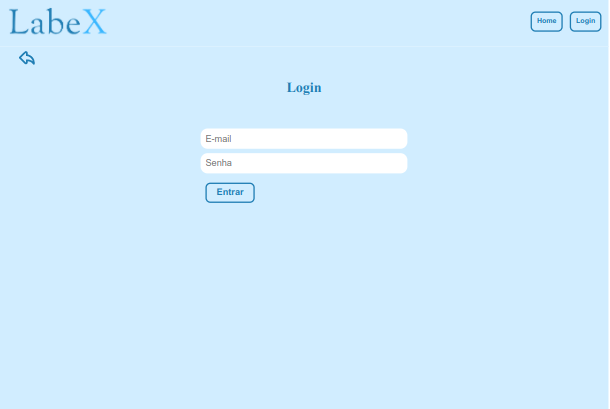

# Acesse o site:

<a href=http://labex-nicole.surge.sh>LabeX</a>

## Login:

E-mail: astrodev@gmail.com.br
Senha: 123456

## Logo:

A Logo foi feita no Canva.

## Paleta de Cores:

A paleta de cores foi escolhida de acordo com a logo:

## Tecnologias utilizadas:

- React
- Axios
- Styled Components
- JavaScript
- Toast React
- Regex

## Sobre / Funcionalidades:

Ao acessar o LabeX, o usuário poderá ir para a página de Lista de Viagens ou para a página de Login. Na página de Lista de Viagens o usuário terá acesso a todas as viagens disponíveis, com um card para cada viagem em que poderá verificar todas as informações sobre ela, poderá também clicar no botão para se increver em algumas das viagens. Para isso, terá que preencher um formulário. Se clicar na página de login, será redirecionado para uma página em que deverá preencher e-mail e senha. Ao preencher corretamente, irá para uma página em que visualizará cards com o nome de cada viagem e terá a opção de deletar cada uma delas. Clicando no nome da viagem será redirecionado para uma página de detalhes da viagem, em que poderá ver também os candidatos pendentes para aquela viagem, podendo aprovar ou reprovar cada um deles e, abaixo, terá uma lista dos candidatos aprovados para aquela viagem. No painel administrativo o administrador poderá clicar em "Criar Viagem", onde deverá preencher um formulário para criar viagens. A responsividade funciona. Tem um gif de "carregando" que aparece nos momentos em que está sendo realizada a troca de página. Foi implementado o uso de "toasts" para substituir os alerts.

## Imagens:

## Desenvolvido por Nicole Prim